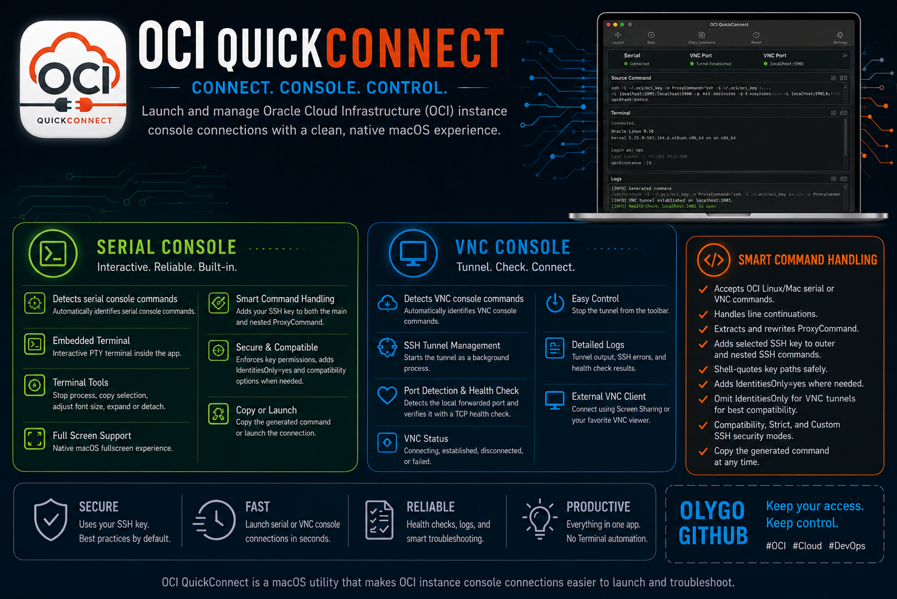

# OCI QuickConnect

**OCI QuickConnect** is a macOS utility that makes OCI instance console connections easier to launch and troubleshoot.

OCI provides long SSH commands for serial console and VNC console access. Those commands are correct, but they are easy to break when copied, edited, or reused. **OCI QuickConnect** lets you paste the original OCI command, select the matching private SSH key, and launch the connection with a clean macOS interface.

Typical issues this app helps avoid:

- forgetting to add the private key to the nested `ProxyCommand`;
- SSH private key permissions that are too open;
- host key conflicts after deleting and recreating an OCI console connection;
- OpenSSH compatibility issues with older `ssh-rsa` negotiation;
- Losing track of which command/key pair belongs to which instance or console connection.

**OCI QuickConnect** generates the final command automatically when you click **Launch**, logs the generated command, and starts the right workflow for the detected connection type.

The app supports both:

- **Serial console connections**, opened inside an embedded terminal/PTY.
- **VNC console tunnels**, launched as a background SSH tunnel with a local port health check.

***Read the following runbook and [watch the video demonstration](https://olygo.objectstorage.eu-frankfurt-1.oci.customer-oci.com/p/7DeA9R9ga4MzQzsX_jPgfNlIYCeoU8wbUbkC5FK0X3rp49o3aXReJOZiSHO3IBIV/n/olygo/b/github_oci_quickconnect/o/oci_quickconnect.mp4)***

[](https://olygo.objectstorage.eu-frankfurt-1.oci.customer-oci.com/p/7DeA9R9ga4MzQzsX_jPgfNlIYCeoU8wbUbkC5FK0X3rp49o3aXReJOZiSHO3IBIV/n/olygo/b/github_oci_quickconnect/o/oci_quickconnect.mp4)

## Features

### Serial Console

- Detects serial console commands automatically.
- Generates the final SSH command at launch time.
- Opens the serial session in an embedded PTY terminal instead of relying on Terminal.app automation.
- Supports interactive input directly inside the app.
- Lets you stop the serial process from the toolbar.
- Lets you select terminal text and copy it with **Copy Selection**.
- Supports terminal expansion inside the main window.
- Supports a detachable serial terminal window.
- Supports native macOS fullscreen.
- Provides adjustable terminal font size.

### VNC Console

- Detects VNC console commands automatically.
- Starts the SSH tunnel as a background process.
- Allow local VNC port customization
- Detects the local forwarded VNC port from the generated SSH command.
- Runs a local TCP health check against the local `-L` bind address and retries briefly while the tunnel becomes ready.
- Shows VNC state: connecting, established, disconnected, failed.
- Lets you stop the VNC tunnel from the toolbar.
- Logs tunnel output and SSH errors.

### Command Handling

- Accepts OCI Linux/Mac serial console or VNC connection commands.
- Handles line continuations in pasted commands.
- Extracts and rewrites `ProxyCommand`.
- Adds the selected SSH key to the outer SSH command.
- Adds the selected SSH key to the nested proxy SSH command.
- Shell-quotes private key paths so paths with spaces or special characters work safely.
- Adds `IdentitiesOnly=yes` for Serial and for the nested proxy SSH command so SSH uses the selected private key instead of trying unrelated SSH agent identities.
- Omits `IdentitiesOnly=yes` from the main VNC tunnel command because that option can prevent some VNC tunnels from starting.
- Adds compatibility options required by some OCI console connection flows.
- Provides explicit **Compatibility**, **Strict**, and **Custom** SSH security modes.
- Provides a **Copy Command** button to copy the generated command without launching it.

### Logs

- The generated command is written to the logs when you launch or copy it.
- Logs include SSH/VNC process output and health check results.
- Logs can be copied to the clipboard.
- Logs can be exported to a file.

Be careful before sharing logs publicly: they may contain OCIDs, hostnames, local ports, usernames, and local filesystem paths.

### UI

- Serial, VNC, and VNC port status indicators.
- Light and dark themes.
- Settings panel for appearance, SSH security mode, local VNC listening port and terminal font size.
- Reset button to clear the current workspace and stop active sessions.
- Dedicated panels for source command, terminal, and logs.

## Requirements

- macOS 12 Monterey or higher
- Apple Silicon or Intel
- A valid OCI instance console connection.
- The private SSH key associated with that OCI console connection.
- The system OpenSSH client available at `/usr/bin/ssh`.
- A VNC client when using VNC mode.

## Installation

Download the `.dmg`, open it, then drag `OCI QuickConnect.app` to `/Applications`.

This application is not cuurently signed, macOS Gatekeeper may block the first launch. 

## How to Use

### 1. Create or Open an OCI Console Connection

In the OCI Console, go to your compute instance and create an instance console connection.

Copy the **Linux/Mac SSH** command provided by OCI for either:

- serial console access; or
- VNC console access.

### 2. Select Your SSH Private Key

Click **Browse** next to **SSH key** and select the private key that matches the public key used when creating the OCI console connection.

The app attempts to apply:

```bash
chmod 600 /path/to/private-key
```

OpenSSH refuses to use private keys that are readable by other users, so this avoids a common SSH error.

### 3. Paste the OCI Source Command

Paste the original OCI command into **Source SSH command**.

You can paste either a serial console command or a VNC command. The app detects the type automatically.

### 4. Click Launch

When you click **Launch**, OCI QuickConnect:

1. parses the source command;
2. detects whether it is serial or VNC;
3. extracts the nested `ProxyCommand`;
4. injects the selected private key into both SSH layers;
5. adds compatibility SSH options;
6. logs the generated command;
7. starts the serial terminal or VNC tunnel.

### 5. Serial Mode

For serial console connections, the app opens an embedded terminal.

You can:

- type directly into the terminal;
- stop the session with **Stop Serial**;
- expand the terminal in the main window;
- detach the terminal into a separate window;
- use fullscreen;
- change the terminal font size;
- select text and click **Copy Selection**.

### 6. VNC Mode

For VNC console connections, the app starts the SSH tunnel in the background.

The app detects the local `-L` forwarded endpoint and checks whether that local endpoint accepts TCP connections. For `localhost` forwards, it can also try local loopback fallbacks such as `127.0.0.1` and `::1`.

Once the VNC tunnel is established, open your VNC client and connect to:

```text
localhost:<local-port>
```

The local port is shown in the VNC port status area and written to the logs.

Use **Stop VNC** to terminate the tunnel.

## SSH Options Added by the App

With the default presets, **OCI QuickConnect** adds the following SSH options to the main Serial SSH command:

```bash
-o IdentitiesOnly=yes
-o HostKeyAlgorithms=+ssh-rsa
-o PubkeyAcceptedKeyTypes=+ssh-rsa
```

For VNC, the main tunnel command still gets the selected private key and the compatibility options, but it intentionally omits `IdentitiesOnly=yes`. VNC is launched as a non-interactive `ssh -N -L` tunnel, and forcing `IdentitiesOnly=yes` on that outer tunnel can over-restrict authentication and stop the tunnel from establishing.

**OCI QuickConnect** also adds the selected private key and `IdentitiesOnly=yes` to the nested `ProxyCommand`. This prevents SSH from trying unrelated identities from your SSH agent, which can otherwise cause errors such as:

```text
Too many authentication failures
```

### Security Modes

The app provides three SSH security modes in **Settings**:

- **Compatibility**: default mode for ephemeral OCI console connections. Adds the host key relaxation options below to both the main SSH command and the nested `ProxyCommand`.
- **Strict**: uses your normal SSH `known_hosts` file and adds `StrictHostKeyChecking=accept-new` to both SSH layers. This avoids non-interactive prompt failures while still blocking changed known host keys.
- **Custom**: lets you choose which SSH options are added. This is useful when your environment requires a different balance between compatibility, host key persistence, and SSH agent behavior.

OCI QuickConnect starts each app launch in **Compatibility** mode. You can still switch to **Strict** or **Custom** for the current session from Settings.

The Settings panel always shows the full SSH option list for transparency. In **Compatibility** and **Strict**, the options are shown as a disabled preset preview so you can see exactly what the mode will do. In **Custom**, the same options become editable.

| SSH option | Compatibility | Strict | Custom |
| --- | --- | --- | --- |
| `-o IdentitiesOnly=yes` | Enabled | Enabled | User controlled |
| `-o HostKeyAlgorithms=+ssh-rsa` | Enabled | Enabled | User controlled |
| `-o PubkeyAcceptedKeyTypes=+ssh-rsa` | Enabled | Enabled | User controlled |
| `-o StrictHostKeyChecking=no` | Enabled | Disabled | User controlled |
| `-o StrictHostKeyChecking=accept-new` | Disabled | Enabled | User controlled |
| `-o UserKnownHostsFile=/dev/null` | Enabled | Disabled | User controlled |

In **Compatibility** mode, OCI QuickConnect adds:

```bash
-o StrictHostKeyChecking=no
-o UserKnownHostsFile=/dev/null
```

These options are intentional. They solve real-world issues with OCI console connections, especially when console connections are deleted and recreated.

If you do not want the app to add the two ephemeral host key options, switch the SSH security mode to **Strict** before clicking **Launch** or **Copy Command**.

In **Strict** mode, OCI QuickConnect adds:

```bash
-o StrictHostKeyChecking=accept-new
```

This matters because VNC tunnels are launched as background SSH processes and cannot answer SSH trust prompts. The nested `ProxyCommand` also cannot reliably ask interactive host-key questions because its standard input/output is being used as the SSH transport. `accept-new` lets SSH store a first-time unknown key in your normal `known_hosts` file, but it still fails if a previously known key changes.

### Custom SSH Settings

In **Custom** mode, the Settings panel lets you decide exactly which SSH options are added to generated commands:

```bash
-o IdentitiesOnly=yes
-o HostKeyAlgorithms=+ssh-rsa
-o PubkeyAcceptedKeyTypes=+ssh-rsa
-o StrictHostKeyChecking=no
-o StrictHostKeyChecking=accept-new
-o UserKnownHostsFile=/dev/null
```

The selected private key is always added with `-i <selected key>` because **OCI QuickConnect** cannot authenticate to the console connection without it.

- **IdentitiesOnly=yes** tells SSH to use the selected private key instead of trying unrelated identities from your SSH agent. For VNC, this option is intentionally not applied to the main tunnel command, but it can still be applied to the nested `ProxyCommand`. If the pasted source VNC command already contains `IdentitiesOnly=yes` in the main command, OCI QuickConnect removes it from the generated main VNC tunnel while keeping it in the proxy layer.
- **HostKeyAlgorithms=+ssh-rsa** enables compatibility with OCI console connection endpoints that still require the legacy `ssh-rsa` host key algorithm.
- **PubkeyAcceptedKeyTypes=+ssh-rsa** enables compatibility with endpoints that expect the legacy `ssh-rsa` public key signature type.
- **StrictHostKeyChecking=no** prevents unknown or changed console host keys from blocking ephemeral OCI console sessions.
- **StrictHostKeyChecking=accept-new** accepts first-time host keys automatically while still rejecting changed keys already present in `known_hosts`.
- **UserKnownHostsFile=/dev/null** avoids reading or writing persistent host key entries for these temporary console endpoints.

The app prevents `StrictHostKeyChecking=no` and `StrictHostKeyChecking=accept-new` from being enabled at the same time because those two values conflict. The selected private key and host-key options are handled consistently, while `IdentitiesOnly=yes` is deliberately asymmetric: kept for Serial and the nested proxy layer, omitted from the main VNC tunnel.

### Safe Key Path Quoting

The generated command shell-quotes the selected private key path. This matters when the path contains spaces, apostrophes, or other shell-sensitive characters.

For example, a key path such as:

```text
/Users/example/SSH Keys/oci console.key
```

is emitted safely as:

```bash
'/Users/example/SSH Keys/oci console.key'
```

### `-o HostKeyAlgorithms=+ssh-rsa`

Modern OpenSSH versions disable or de-prioritize some legacy RSA/SHA-1 based algorithms by default.

Some OCI console connection endpoints or proxy hops may still present an `ssh-rsa` host key algorithm. Without this option, SSH can fail before authentication with an error similar to:

```text
no matching host key type found. Their offer: ssh-rsa
```

This option appends `ssh-rsa` to the list of accepted host key algorithms for this connection.

### `-o PubkeyAcceptedKeyTypes=+ssh-rsa`

This option allows `ssh-rsa` for public key authentication compatibility.

It can help when the server side only accepts RSA signatures using the older `ssh-rsa` name. Without it, authentication may fail even when the selected private key is correct.

On newer OpenSSH versions, the modern option name is `PubkeyAcceptedAlgorithms`. `PubkeyAcceptedKeyTypes` is kept here because it remains widely recognized and matches many existing compatibility examples.

### `-o StrictHostKeyChecking=no`

OCI instance console connections are often short-lived. If you delete a console connection and create a new one for the same instance, the SSH host key may change.

With normal strict host key checking, SSH may stop with a warning such as:

```text
WARNING: REMOTE HOST IDENTIFICATION HAS CHANGED!
```

For normal SSH servers, that warning is important. For ephemeral OCI console connections, it can also be a routine side effect of recreating the console connection.

This option tells SSH not to block on unknown or changed host keys for this generated console connection.

This option is controlled by the SSH security mode. It is added in **Compatibility** mode and replaced by `StrictHostKeyChecking=accept-new` in **Strict** mode.

### `-o UserKnownHostsFile=/dev/null`

This option tells SSH not to persist host keys for these console connections in your normal `~/.ssh/known_hosts` file.

That avoids polluting your known hosts file with short-lived OCI console connection endpoints and prevents stale host keys from blocking future console sessions.

This option is controlled by the SSH security mode. It is added in **Compatibility** mode and omitted in **Strict** mode.

### `-o StrictHostKeyChecking=accept-new`

This option is used in **Strict** mode.

It allows SSH to automatically trust and save a host key the first time that host is seen. After that, SSH still checks the saved key and fails if the host key changes.

**OCI QuickConnect** uses this instead of a fully interactive prompt because VNC is launched as a background tunnel and the nested `ProxyCommand` is not a normal interactive terminal session. Without this option, SSH can fail with messages such as:

```text
ssh_askpass: exec(/usr/X11R6/bin/ssh-askpass): No such file or directory
Host key verification failed.
```

### Security Trade-off

The combination of:

```bash
-o StrictHostKeyChecking=no
-o UserKnownHostsFile=/dev/null
```

means SSH will not perform persistent host identity verification for the generated OCI console connection.

That is convenient for ephemeral OCI console workflows, but it reduces protection against man-in-the-middle attacks. Do not copy this pattern blindly into general-purpose SSH commands for normal servers.

OCI QuickConnect is designed for short-lived OCI instance console connection commands copied from the OCI Console. Use these options only when that trade-off is acceptable for your environment.

If your environment requires host key persistence and verification, choose **Strict** mode. In Strict mode, the generated command will not include `StrictHostKeyChecking=no` or `UserKnownHostsFile=/dev/null` in either the main SSH command or the nested `ProxyCommand`. SSH will use your normal `known_hosts` file with `StrictHostKeyChecking=accept-new`.

If an OCI console connection is recreated and SSH reports that the host key changed, either remove the old entry from `known_hosts` after validating that this is expected, or switch back to **Compatibility** mode for ephemeral console workflows.

## Command Transformation Example

Input from OCI, simplified:

```bash
ssh -o ProxyCommand='ssh -W %h:%p ...' ocid1.instanceconsoleconnection.oc1...@instance-console...
```

Generated output, simplified:

```bash
ssh -i '/path/to/key' \
  -o IdentitiesOnly=yes \
  -o HostKeyAlgorithms=+ssh-rsa \
  -o PubkeyAcceptedKeyTypes=+ssh-rsa \
  -o StrictHostKeyChecking=no \
  -o UserKnownHostsFile=/dev/null \
  -o ProxyCommand='ssh -i '\''/path/to/key'\'' -o IdentitiesOnly=yes -o StrictHostKeyChecking=no -o UserKnownHostsFile=/dev/null -W %h:%p ...' \
  ocid1.instanceconsoleconnection.oc1...@instance-console...
```

With **Strict** security mode, Serial commands keep `IdentitiesOnly=yes` and the `ssh-rsa` compatibility options, while VNC main tunnel commands still omit `IdentitiesOnly=yes`. Strict mode adds:

```bash
-o StrictHostKeyChecking=accept-new
```

and omits:

```bash
-o StrictHostKeyChecking=no
-o UserKnownHostsFile=/dev/null
```

from both the main SSH command and the nested `ProxyCommand`.

The important part is that the private key is applied to both:

- the outer SSH command;
- the inner SSH command inside `ProxyCommand`.

## Buttons and Controls

### Top Status Area

- **Serial**: shows whether the embedded serial terminal is connected, disconnected, connecting, disconnecting, or failed.
- **VNC**: shows whether the VNC tunnel is established, disconnected, connecting, disconnecting, or failed.
- **VNC Port**: shows local port health check state.
- **SSH key**: selected private key path.
- **Browse**: selects the private key.
- **Theme toggle**: switches between light and dark mode.

### Actions

- **Launch**: generates and starts the serial or VNC connection.
- **Security mode badge**: shows whether generated commands are using **Compatibility**, **Strict**, or **Custom** SSH mode.
- **Stop VNC**: terminates the active VNC SSH tunnel.
- **Stop Serial**: terminates the embedded serial terminal process.
- **Reset**: stops active sessions and clears the current workspace.
- **Check VNC**: manually checks the local forwarded VNC port.
- **Copy Selection**: copies selected text from the embedded terminal.
- **Copy Command**: generates and copies the final SSH command without launching it.
- **Copy Logs**: copies all logs to the clipboard.
- **Export Logs**: saves logs to a text file.
- **Expand Terminal**: gives the serial terminal more space inside the main window.
- **Detach Terminal**: opens the serial terminal in a separate resizable window.
- **Fullscreen**: toggles macOS fullscreen for the current window.

### Settings

- **Theme**: switches between dark and light mode.
- **Security mode**: chooses between Compatibility, Strict, and Custom SSH behavior.
- **SSH options**: shows every option used or not used by the selected mode. Compatibility and Strict are read-only previews; Custom makes the same options editable.
- **Terminal font**: changes the embedded and detached terminal font size.
- **Custom VNC Local Port**: change the local listening port used for VNC SSH tunnels. By default, VNC tunnels listen on local port `5900`. You can change this port in range 1024 to 65535. Only the local listening port is changed. The remote VNC port remains 5900.

## Troubleshooting

### The app says it cannot find `ProxyCommand`

Make sure you pasted the Linux/Mac OCI console connection command, not a Windows/PuTTY command.

The app expects an SSH command containing:

```bash
-o ProxyCommand='...'
```

or:

```bash
-o ProxyCommand="..."
```

### SSH says the private key permissions are too open

Select the key with **Browse** again. The app tries to apply `chmod 600` automatically.

You can also fix it manually:

```bash
chmod 600 /path/to/private-key
```

### Serial connects and then exits

Check the logs for the SSH exit code and error message.

Common causes:

- wrong private key;
- expired or deleted OCI console connection;
- source command copied from the wrong instance;
- network connectivity issue;
- OCI console connection still provisioning.

### VNC is established but the VNC client cannot connect

Check the VNC port status and logs.

Try connecting your VNC client to:

```text
localhost:<local-port>
```

If the health check fails but your VNC client connects successfully, the local tunnel is usable and the health status is only stale. You can click **Check VNC** to retry the local TCP check. If both the health check and your VNC client fail, recreate the OCI console connection and launch again.

### The generated command contains sensitive data

The command can include OCIDs, hostnames, usernames, local paths, and SSH options. Review logs before sharing screenshots or bug reports publicly.

## Privacy and Local Data

OCI QuickConnect runs SSH locally on your Mac and does not share, upload, send any data outside your Mac.


## License

**OCI QuickConnect** is currently distributed as proprietary binary software.

The downloadable `.dmg` may be used for personal use or internal professional use, but redistribution, resale, modification, reverse engineering, or repackaging are not permitted without prior written permission.

See [LICENSE](LICENSE) for details.

**OCI QuickConnect** uses third-party open source components. See [THIRD_PARTY_NOTICES.md](THIRD_PARTY_NOTICES.md).

## Contact

[github@olygo.com](mailto:github@olygo.com)